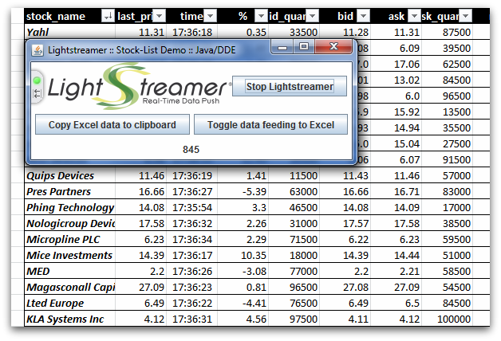

# Lightstreamer - Basic Stock-List Demo - Excel (DDE) Client #
<!-- START DESCRIPTION lightstreamer-example-stocklist-client-dde -->

This project includes a demo client showing integration between [Lightstreamer Java SE Client](http://www.lightstreamer.com/docs/client_javase_api/index.html) and [Dynamic Data Exchange (DDE)](http://en.wikipedia.org/wiki/Dynamic_Data_Exchange) Server for Excel.

[](http://demos.lightstreamer.com/Java_DDEDemo_Basic/java-dde-stocklist-demo.zip)<br>
*To run this demo you must have Java for Windows x86 (32bit) installed*. If you don't have Java already installed, please download it from [here] (http://www.oracle.com/technetwork/java/javase/downloads/index.html).<BR/>
To run the demo: [download it from here](http://demos.lightstreamer.com/Java_DDEDemo_Basic/java-dde-stocklist-demo.zip); unzip *java-dde-stocklist-demo.zip*; launch `start.bat`.


[Dynamic Data Exchange (DDE)](http://en.wikipedia.org/wiki/Dynamic_Data_Exchange) is a technology for communication between multiple applications under Microsoft Windows, often used for automatically filling a Microsoft Excel spreadsheet with data.<br>
This Java application is basically a DDE bridge, which injects the real-time updates received from Lightstreamer Server into an Excel spreadsheet. The quotes for 30 stock items are managed.<br>

The application connects to Lightstreamer Server on one side (by leveraging the <b>Java SE Client API for Lightstreamer</b>) and delivers the received data to any DDE-enabled application that is running on the PC on the other side (by leveraging a third-party DDE component for Java).<br>

Launch the application, then click on "Start Lightstreamer" to connect to Lightstreamer Server and subscribe to the quotes. You will see the update count spinning in the lower margin. Now click on "Copy Excel data to clipboard". The DDE subscription info will be copied into the clipboard. Open an Excel speadsheet and paste the data (CTRL-V). The real-time updates will show up on the spreadsheet.<br>

To temporarily stop the DDE Server, without closing the Lightstreamer connection, click on "Toggle data feeding to Excel".

## Dig the Code ##
The application is divided into 3 main public classes (alphabetical order).
* <b>DDEServer.java</b>: contains the actual DDE Server code. This part is responsible of receiving Lightstreamer data updates (and storing into an item cache) and feeding connected Excel instances trough postAdvise() update requests.
  For more info, please read the Neva Coroutine API reference.
* <b>LightstreamerConnectionHandler.java</b>: a LSClient class wrapper, exporting handy methods (like connect, changeStatus, subscribe, etc) used by the main StockListDemo.java class.
* <b>StockListDemo.java</b>: it's the main Java/Swing application that is controlling Lightstreamer client and DDE Server interfaces. It is composed by a JFrame and several JPanel. For more info, please read the Oracle JDK API reference.
  
Check out the sources for further explanations.
  
<i>NOTE: not all the functionalities of the Lightstreamer Java SE Client & DDE Server demo are exposed by the classes listed above. You can easily expand those functionalities using the [Lightstreamer Java SE Client API](http://www.lightstreamer.com/docs/client_javase_javadoc/index.html) as a reference.<br>
If in trouble check out the [specific Lightstreamer forum](http://www.lightstreamer.com/vb/forumdisplay.php?f=12). </i>

<!-- END DESCRIPTION lightstreamer-example-stocklist-client-dde -->

# Build #

If you want to skip the build and deploy processes of this demo please note that you can click the image or link above to download a ".zip" file ready for the launch.<br>
Installation instructions:
* Click the image or link above and download the file *java-dde-stocklist-demo.zip file*; 
* unzip *java-dde-stocklist-demo.zip*; 
* launch `start.bat`.
<br>

Otherwise, to directly import the project as is you need the Eclipse IDE and Neva Coroutine libraries installed in the default path. Moreover, you need to add Coroutine4Java.jar and JavaDde.jar to your Java build path, please refer to Eclipse documentation in order to know how to do so. These two .jar are found in the Neva product.<br>
For more information regarding the Neva Coroutine libraries that enables this application to communicate over DDE to Excel, go to [http://www.nevaobject.com](http://www.nevaobject.com).
For more information regarding Eclipse and how to run it, please go to [http://www.eclipse.org](http://www.eclipse.org), just download the latest version in its "classic" package.
  
<i>NOTE: You may also use the sources included in this project with another IDE or without any IDE but such approach is not covered in this readme. In any case you always need the Neva Coroutine libraries.</i>

Obviously you also need to have the Lightstreamer server installed somewhere. If you don't have it, go download it here: http://www.lightstreamer.com/download.htm and follow the instructions in the package to install it.
However, this release points to our demo Lightstreamer server, so if you just want to see how the application works, you can skip this step.
  
From your Lightstreamer installation extract the files included in the Lightstreamer/DOCS-SDKs/sdk_client_java_se/lib folder and copy them into the lib/ folder of this project.<br>
You're now ready to import the project into Eclipse.

From Eclipse, to compile and run the application right-click on the project in the Package Explorer and click Run As -> Java Application.
At this point, your Lightstreamer Client & DDE Server demo is compiled and executed. Just click "Start Lightstreamer" to make the application connect to the configured Lightstreamer Push Server, then click on "Copy Excel data to clipboard", open a new Excel spreadsheet, right click on a cell and click "Paste". At this point, Excel will establish a hotlink to this demo application, which is at the same time streaming real-time data to it.
Alternatively you can use a launch script like this:
```cmd
@echo off

call "%JAVA_HOME%\bin\java.exe" -Dsystem.library.path=. -cp "java_dde_sld.jar";"../lib/ls-client.jar" javasedemo.dde.StockListDemo
pause
```
<br>
  
# Deploy #
  
You may want to make the demo application point to your Lightstreamer server. As written above, this is not mandatory. To do so, open src/javasedemo/dde/StockListDemo.java and change the "PUSH_SERVER_URL" variable value.
The example requires that the [QUOTE_ADAPTER](https://github.com/Weswit/Lightstreamer-example-Stocklist-adapter-java) and [LiteralBasedProvider](https://github.com/Weswit/Lightstreamer-example-ReusableMetadata-adapter-java) have to be deployed in your local Lightstreamer server instance. 
The factory configuration of Lightstreamer server already provides this adapter deployed.<br>

# See Also #

## Lightstreamer Adapters Needed by This Demo Client ##
<!-- START RELATED_ENTRIES -->

* [Lightstreamer - Stock-List Demo - Java Adapter](https://github.com/Weswit/Lightstreamer-example-Stocklist-adapter-java)
* [Lightstreamer - Reusable Metadata Adapters - Java Adapter](https://github.com/Weswit/Lightstreamer-example-ReusableMetadata-adapter-java)

<!-- END RELATED_ENTRIES -->

## Related Projects ##

* [Lightstreamer - Stock-List Demos - HTML Clients](https://github.com/Weswit/Lightstreamer-example-Stocklist-client-javascript)
* [Lightstreamer - Basic Stock-List Demo - jQuery (jqGrid) Client](https://github.com/Weswit/Lightstreamer-example-StockList-client-jquery)
* [Lightstreamer - Stock-List Demo - Dojo Toolkit Client](https://github.com/Weswit/Lightstreamer-example-StockList-client-dojo)
* [Lightstreamer - Basic Stock-List Demo - .NET Client](https://github.com/Weswit/Lightstreamer-example-StockList-client-dotnet)
* [Lightstreamer - Basic Stock-List Demo - Java SE (Swing) Client](https://github.com/Weswit/Lightstreamer-example-StockList-client-java)
* [Lightstreamer - Basic Stock-List Demo - Excel (RTD) Client](https://github.com/Weswit/Lightstreamer-example-StockList-client-rtd)

# Lightstreamer Compatibility Notes #

- Compatible with Lightstreamer Java Client API v. 2.5.2 or newer.
- For Lightstreamer Allegro (+ Java Client API support), Presto, Vivace.
